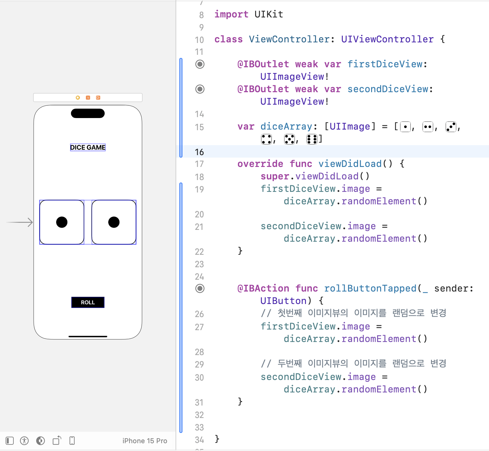
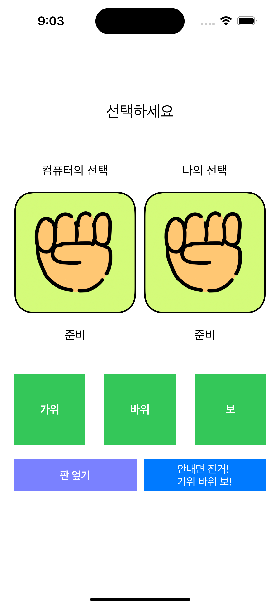
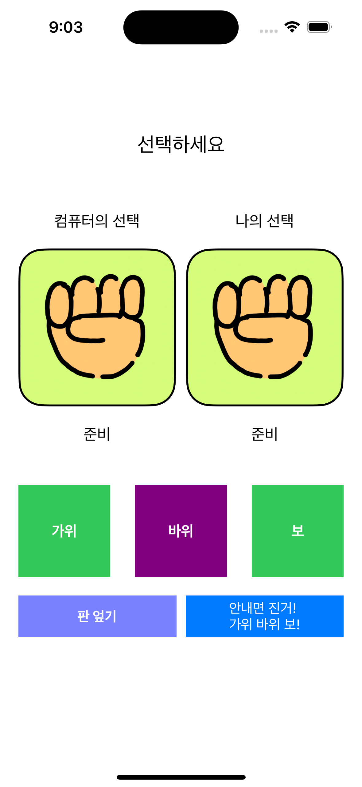
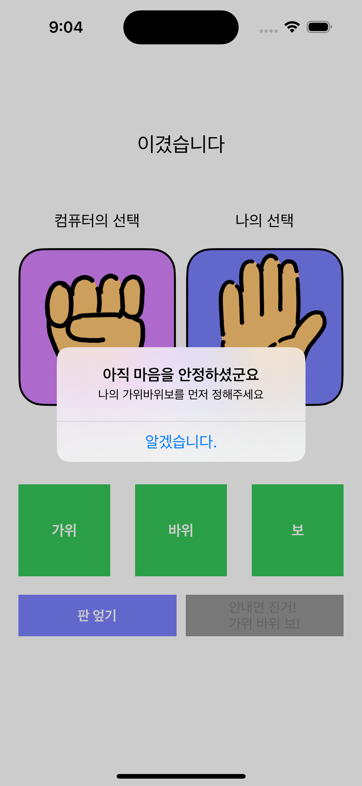

# UIKit_Study

&lt;앨런 iOS 앱 개발 (15개의 앱을 만들면서 근본원리부터 배우는 UIKit) - MVVM까지> 강의 학습

---

### 기초 앱 1

24.02.10 학습 완료

<b>학습 내용<b/>

- UIKit 프로젝트 생성 방법
- 오토레이아웃 간단한 설정 (오토레이아웃 width 값 경고 뜨면 >= 설정해줌)
- 라이브러리 사용 방법
- 화면 코드 작성 방법

 
 

---

### 기초 앱 2

24.02.11 학습 완료

<b>학습 내용<b/>

- Stack View
- #imageLiteral() 사용법
- 코드 및 assets는 빌드(command + B)하면 저장됨
- array.randomElement()

---

### 기초 앱 3

24.02.14 학습 완료

    
    
    

<b>학습 내용<b/>

- UIimage(named:)
- 알림창 사용

추가로 학습해야하는 부분

1. UIColor
2. Errer haddling
3. 알림창 띄우기
